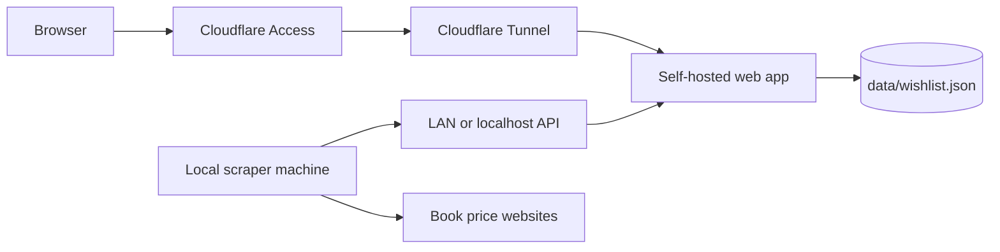
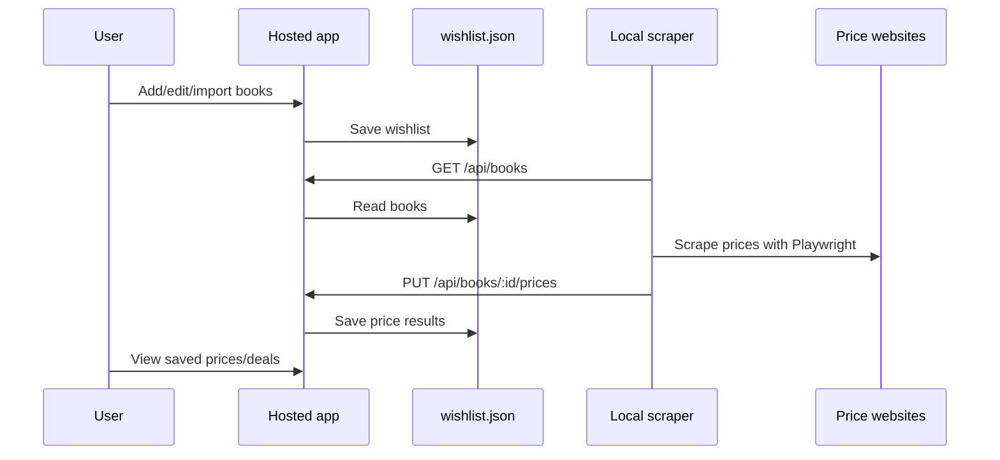

# Book Wishlist

A local tool for tracking books you want to buy and finding the cheapest second-hand prices across multiple sources.

## Features

- **Book wishlist** — track books you want to read/buy, with cover images, ISBNs, and notes
- **Amazon import** — import wishlists using the [Amazon Wishlist Exporter](https://chromewebstore.google.com/detail/amazon-wishlist-exporter/jggmpdkkdepkhdbmfplkabhjkahgnoip) Chrome extension (JSON)
- **Goodreads import** — import your to-read shelf from a Goodreads CSV export
- **Price checking** — scrapes second-hand book listings with a local Playwright script
- **Multi-edition ISBN lookup** — fetches all known ISBNs for a book via Open Library so the scraper can check across editions
- **Deals view** — flat list of all offers sorted by price, or grouped by seller to consolidate orders and save on shipping
- **Exclude US sellers** — filter toggle to hide US-based sellers (expensive shipping to EU)
- **Metadata from multiple sources** — searches both Open Library and Google Books in parallel for book info
- **Bulk metadata enrichment** — fetch covers and ISBNs for all books missing metadata in one click
- **Local price scraper** — price checks run on demand from a local machine with Playwright, then push saved prices back to the app
- **Logs** — persistent error log with a dedicated viewer to inspect scraping failures

## Setup

```bash
git clone <your-repo-url>
cd book-wishlist
npm run install:all
npx playwright install chromium
npm run dev
```

Open `http://localhost:5174`

## Architecture

```
client/          → Vite + React + TypeScript + Tailwind CSS
server/          → Express API + production static file server
scripts/         → One-off import/scrape scripts
data/            → wishlist.json + logs.json (local, gitignored)
```

- **Client** (port 5174): React SPA with Vite dev server, proxies `/api` to the server
- **Server** (port 3001): Express API for book CRUD, imports, metadata enrichment, logs, JSON file storage
- **Scraper**: manual local Playwright script that can update either a local `wishlist.json` file or a running server API
- **Data**: `data/wishlist.json` stores all books and cached prices locally. `data/logs.json` stores error logs.





### Price sources

The manual scraper currently checks IberLibro/AbeBooks from a local machine using Playwright (headless Chromium). Saved prices are written back to the app and displayed in the cards and Deals view. The always-on server does not install or run Playwright.

## Commands

```bash
npm run dev              # Start both client and server
npm run build            # Build client + server for production
npm start                # Start the production server after building
npm run install:all      # Install dependencies for root, client, and server

# One-off scripts (run from project root)
npm run import:amazon    # Import from Amazon JSON exports (searches Open Library for ISBNs)
npm run import:amazon -- --skip-enrich   # Fast import without Open Library lookup
npm run scrape:prices    # CLI price scrape for local data/wishlist.json
```

## Self-hosting

The app is designed to be self-hosted behind Cloudflare Tunnel + Cloudflare Access. Do not commit tunnel tokens, email addresses, hostnames you consider private, or real wishlist data.

1. Copy the example Compose file:

   ```bash
   cp docker-compose.web.example.yml docker-compose.yml
   ```

   If you also want Compose to run `cloudflared`, use the full example instead:

   ```bash
   cp docker-compose.example.yml docker-compose.yml
   cp .env.example .env
   ```

2. Create a Cloudflare Tunnel and put its token in `.env`:

   ```bash
   CLOUDFLARE_TUNNEL_TOKEN=...
   ```

3. In Cloudflare Zero Trust, publish your hostname to:

   ```text
   http://web:3001
   ```

   Add an Access policy that allows only your email address.

4. Start the app:

   ```bash
   docker compose up -d --build
   ```

The example Compose file also binds the web app to `127.0.0.1:3001` on the host for local/LAN maintenance. If you do not need host access, remove the `ports` block and let only `cloudflared` reach the `web` service.

## Running price checks locally

Install dependencies and the Chromium browser on the machine that will run the scraper:

```bash
npm run install:all
npx playwright install chromium
```

If the hosted app is bound to `127.0.0.1` on the server, open an SSH tunnel from the scraper machine:

```bash
ssh -L 3001:127.0.0.1:3001 user@server.local
```

Then run the scraper in another terminal:

```bash
BOOK_WISHLIST_API=http://127.0.0.1:3001 npm run scrape:prices
```

If you intentionally expose the app on your LAN instead, point the scraper at the server address:

```bash
BOOK_WISHLIST_API=http://server.local:3001 npm run scrape:prices
```

Useful options:

```bash
npm run scrape:prices -- --force
npm run scrape:prices -- --limit 10
npm run scrape:prices -- --file ./data/wishlist.json
npm run scrape:prices -- --api http://server.local:3001
```

When `BOOK_WISHLIST_API` or `--api` is set, the scraper reads books from `GET /api/books` and writes prices back with `PUT /api/books/:id/prices`. When no API is set, it updates the local JSON file directly.

## Importing Books

### Amazon

1. Install the [Amazon Wishlist Exporter](https://chromewebstore.google.com/detail/amazon-wishlist-exporter/jggmpdkkdepkhdbmfplkabhjkahgnoip) Chrome extension
2. Go to your Amazon wishlist page
3. Click the extension icon → **Export as JSON**
4. In the app, click **Import** → **Amazon** tab → upload the JSON file(s)

Or from the CLI: place files in `~/Downloads/` and run `npm run import:amazon`

### Goodreads

1. Go to [goodreads.com/review/import](https://www.goodreads.com/review/import)
2. Click **Export Library** and download the CSV
3. In the app, click **Import** → **Goodreads** tab → upload the CSV

Only books on the **to-read** shelf are imported. ISBN and page count come directly from the CSV.

### After importing

Click the **refresh icon** in the header to bulk-fetch covers and edition ISBNs from Open Library and Google Books for all books missing metadata.

## Data Backup

Your book data lives in `data/wishlist.json` (gitignored). To avoid losing it:

- **Cloud sync**: symlink to a synced folder (Dropbox, iCloud, etc.):
  ```bash
  mv data/wishlist.json ~/Dropbox/wishlist.json
  ln -s ~/Dropbox/wishlist.json data/wishlist.json
  ```
- **Manual backup**: `cp data/wishlist.json ~/backup/wishlist-$(date +%Y%m%d).json`
